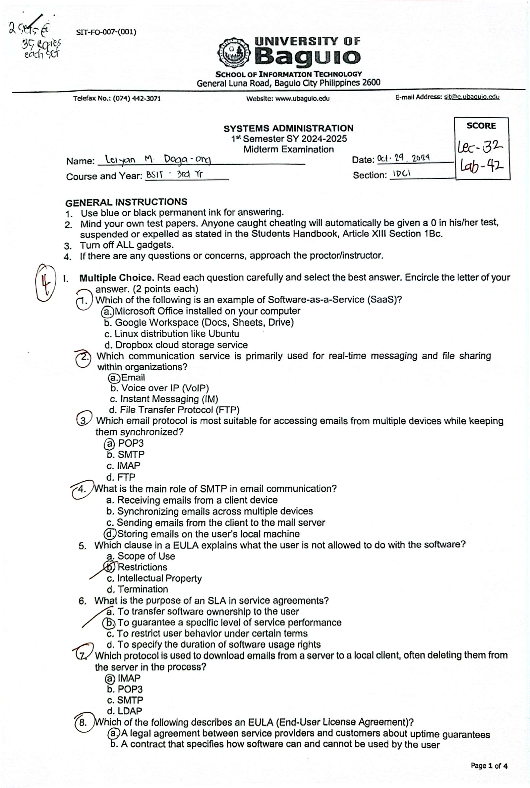
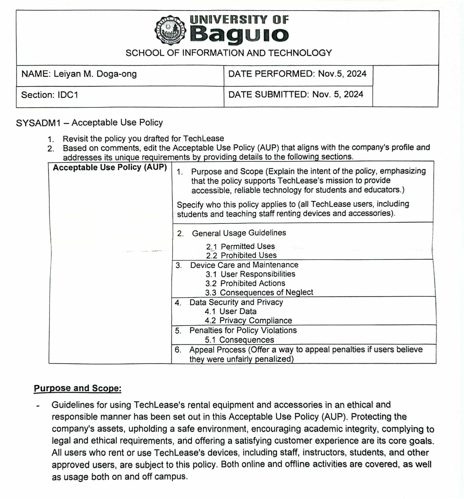

<table style="width: 100%; border-collapse: collapse;">
  <tr>
    <td style="text-align: left; border: none;">
      
    </td>
    <td style="text-align: center; font-size: 24px; font-weight: bold; border: none;">
      SCHOOL OF INFORMATION TECHNOLOGY
    </td>
    
  </tr>
  <tr>
    <td style="border: none;"><strong>NAME:</strong> Leiyan M. Doga-ong</td>
    <td style="border: none;"></td>
    
  </tr>
  <tr>
    <td style="border: none;"><strong>SECTION:</strong> IDC1</td>
    <td style="border: none;"><strong>DATE SUBMITTED:</strong> December 8, 2024</td>
  </tr>
</table>

## SYSADM1 PORTFOLIO

# Table of Contents

| Name of Activities                      | Date of Activity | Page No. |
|-----------------------------------------|------------------|----------|
| **First Grading**                       |                  |          |
| Quizzes                                 |                  |          |
| > Quiz 1                                |September 10, 2024|4         |
| Other Activities                        |                  |          |
| > Seatwork 1                            |August 20, 2024   |3         |
| > Assignment 1                          |August 21, 2024   |3         |
| First Grading Exam                      |September 17, 2024|4         |
|                                         |                  |          |
| **Midterms**                            |                  |          |
| Other Activities                        |                  |          |
| > Seatwork 1                            |October 1, 2024   |7         |
| > Assignment 1                          |October 16, 202   |8         |
| Midterm Exam                            |October 29, 2024  |9         |
|                                         |                  |          |
| **Finals**                              |                  |          |
| Other Activities                        |                  |          |
| > Assignment 1                          |November 5, 2024  |10        |
| > Assignment 2                          |November 19, 2024 |11        |
| > Seatwork 1                            |November 26, 2024 |12        |
| Final Exam                              |December 11, 2024 |          |
|                                         |                  |          |
| Course Reflection                       |December 8, 2024  |13        |

# First Grading Activities

**Seatwork 1:**

**Assignment 1:**

**Quiz 1:**

**First Grading Lecture Exam:**

**First Grading Laboratory Exam:**

# Midterm Activities

**Seatwork 1:**

**Assignment 1:**

**Midterm Exam:**

# Final Activities
**Assignment 1:**

**Assignment 2:**

**Seatwork 1:**

**Course Reflection**

What were your initial expectations for the course? Did the course meet,
exceed, or fall short of these expectations?
> My initial goals for the Systems Administration course were to get get a thorough understanding of how to efficiently manage and maintain computer systems. I was looking forward to learning about network setups, server management, and troubleshooting methods. In addition to discussing these subjects, the course went above and beyond my expectations by including exercises based on actual situations.

What were the main topics or concepts covered in the course? How did
these topics contribute to your understanding of the subject matter?
> Network infrastructure, system security protocols, and user account administration were among the main subjects covered in the course. These concepts greatly improved my understanding of the relationships between different parts of a system and the importance of preserving system security and integrity. 

Reflecting on your learning process, what were the most effective
strategies or techniques that helped you grasp and retain the course
material?
> Being able to apply what I had learned in lab sessions was one of the most effective strategies. This hands-on approach improved my understanding and retention of the subject by reinforcing ideas like system backups and recovery procedures.

Were there any particular assignments, projects, or activities that
significantly enhanced your learning experience? Why were they
effective?
> Setting up a virtual server environment was one of the most essential activities. It was beneficial since it required critical thinking and actual application of knowledge, which helped me understand server management and troubleshooting. 

Did you encounter any challenges or difficulties during the course? How
did you overcome these obstacles, and what did you learn from them?
> At first, I had trouble understanding complicated networking principles. I looked for more online tools and worked with classmates to get past this. I learned from this experience how crucial it is to persevere and use a variety of tools while tackling challenging subjects.

Did the course encourage critical thinking and analysis? How did it
promote higher-order thinking skills, such as problem-solving or
decision-making?
> Yes, the course promoted critical thinking through case studies in which we were required to evaluate system problems and suggest solutions. This method encouraged higher-order thinking abilities because it challenged us to critically assess events and make knowledge-based decisions. 

Reflecting on your personal growth, what new knowledge, skills, or
perspectives did you gain from this course?
> I improved my comprehension of system management processes and acquired useful skills in solving issues. My understanding of the function of a systems administrator has changed, and I now recognize the value of proactive security and maintenance in IT environments.

How do you plan to apply what you have learned in this course to your
future studies, career, or personal life?
> I plan to apply what I learned in this course to my future studies by pursuing advanced topics in network security and cloud computing. My career will also benefit greatly from the abilities I learned as I look for positions in IT administration, where efficient system management is essential. 
